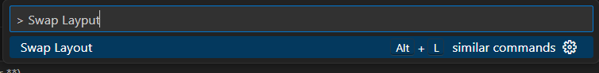
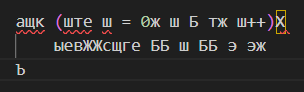
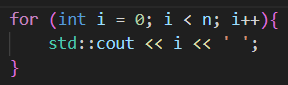

# Layout Swap

> Layout Swap - расширение, позволяющее быстро конвертировать текст, случайно набранный в русской раскладке, обратно в английскую

## Как работает:

После выделения текста, написаного кириллицей, необходимо выполнить команду в *command palette* или использовать горячие клавиши `Alt + L` для быстрого доступа

>Команда:
>
> 

>До:
>
>

>После:
>
>

## Требования к раскладке клавиатуры

Работает корректно со стандартными раскладками Windows. Русская - "ЙЦУКЕН", английская - "QWERTY"
